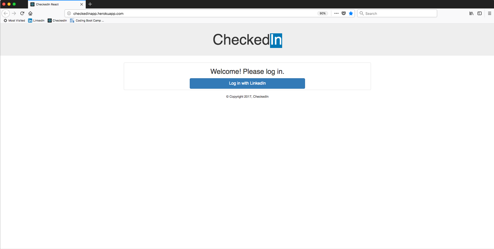
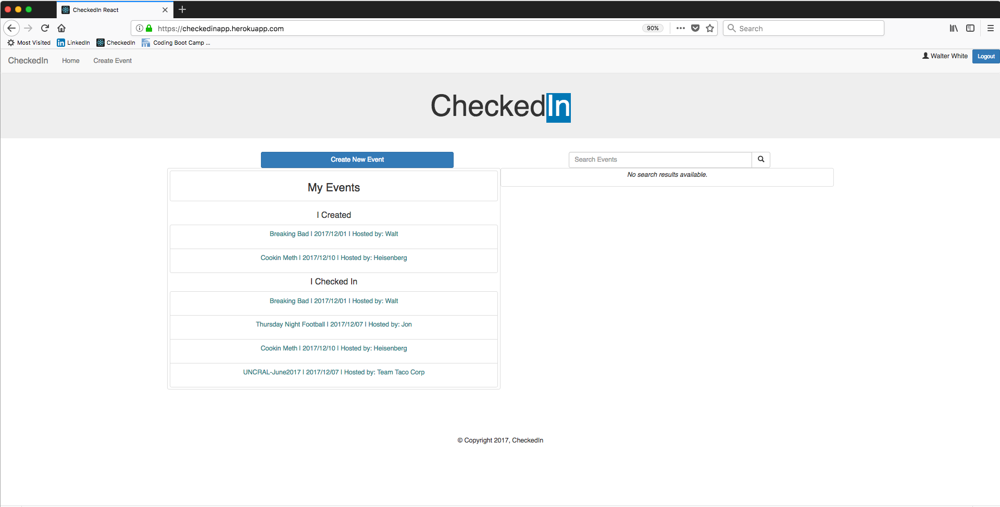

# CheckedIn_React
Final Project for UNC Coding School

## Team Members:
* **Jon Riddick** - GitHub: [Jon Riddick](https://github.com/jonriddick)
* **Zeynep Dayar** - GitHub: [Zeynep Dayar](https://github.com/zdayar)
* **Kristin Glaze** - GitHub: [Kristin Glaze](https://github.com/kiglaze)
* **Steve Murphy** - GitHub: [Steve Murphy](https://github.com/stevemurphy256)

## Project Description

CheckedIn_React is a full-stack MERN app developed to assist event Organizers and Hosts with the task of networking with their event Attendees. The app uses the Passport Linkedin OAuth 2.0 library to retrieve user profile information for both the Host as well as the Attendees and populate a Mongo Database. Once the event is complete the Host can easily retrieve the Linkedin contact information for any or all of their Attendees and connect with them on Linkedin.

## Getting Started on your local machine

- Clone this repo to your computer.
- Make sure you have Mongo Database running before attempting to start the app.
- Navigate to the project folder and run `yarn install`.
- Change directory into the `client` folder and run `yarn install` again.
- Change back into the project folder and run `yarn start`.
- The app should open in the browser.
- You can open your browser and navigate to localhost:3000, alternatively.

## Technologies used
- MongoDB
- Express
- ReactJS
- Node
- Axios
- Mongoose
- Express Session

## Demo Screenshots
Event Hosts start here: Login Page

Clicking on the login button creates a local account and allows the Host to create an event.

--------------------------------------------------------------------

Once the host is logged in they go to the Home page:

The Host can view all the events they have hosted or attended as well as any Attendee they have saved from a previous event. To create a new event click on the `Create New Event` button.

--------------------------------------------------------------------

Fill out the form and click on `Create Event`:

--------------------------------------------------------------------

The Event Page:

Event Attendees will start here. Using their own device, click on the `CheckIn with LinkedIn` button. This will add them to the Event Guests component. Clicking on the `Visit on LinkedIn` button takes you to their Linkedin so they can be added to your network.

--------------------------------------------------------------------

## MongoDB and mongoose
The app uses 2 schemas, Event and User. 

The Event collection is populated with the input form on the Create Event page and includes an array to save attendees from hosted events.

The User collection is populated with profile information retrieved from the Linkedin server using the `Passport Linkedin OAuth2.0 library.

## WEBSITE LINK

## Special Thanks!
Team Taco Corp would like to thank our instructor, Andre Asselin
and our TA's Kevin Collins and Joseph Depompeis for their invaluablble help. Especially Kevin who never complained once about a late night hangout!

